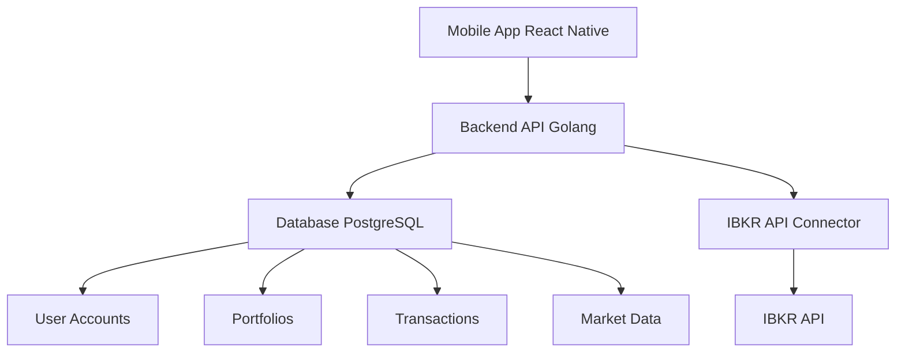

# Stock Trading App Architecture

## Components

1. **Mobile App (React Native)**
   - User interface for trading, portfolio tracking, and account management
   - Communicates with the backend API

2. **Backend API (Golang)**
   - Handles business logic, authentication, and API requests
   - Connects to the database and IBKR API

3. **Database (PostgreSQL)**
   - Stores user accounts, portfolios, transactions, and market data

4. **IBKR API Connector**
   - Handles integration with the Interactive Brokers API
   - Manages market data streaming and order execution

## Architecture Diagram

## Key Features

1. **User Authentication**
   - Secure login and registration
   - JWT-based authentication

2. **Market Data**
   - Real-time and historical data from IBKR
   - Data caching and optimization for mobile

3. **Order Management**
   - Basic buy/sell functionality
   - Order status tracking

4. **Portfolio Tracking**
   - Real-time portfolio value
   - Transaction history

5. **Security**
   - Encrypted communication
   - Secure API keys management

## Technology Stack

- **Mobile App:** React Native
- **Backend:** Golang
- **Database:** PostgreSQL
- **API Integration:** IBKR API
- **Authentication:** JWT
- **Communication:** RESTful API

## Detailed Component Analysis

### 1. Mobile App (React Native)

**Responsibilities:**

- Provide a user-friendly interface for trading operations
- Display real-time market data and portfolio information
- Handle user authentication and account management
- Send and receive data from the backend API

**Key Technologies:**

- React Native for cross-platform mobile development
- Redux or Context API for state management
- Axios or Fetch API for network requests
- React Navigation for routing

**Integration Points:**

- Communicates with the backend API for all data operations
- Integrates with device features like push notifications

**Security Considerations:**

- Secure storage of authentication tokens
- Encrypted communication with the backend
- Input validation to prevent injection attacks

**Performance Considerations:**

- Efficient data fetching and caching
- Optimized UI rendering for smooth user experience
- Offline capabilities for basic functionality

### 2. Backend API (Golang)

**Responsibilities:**

- Handle all business logic for trading operations
- Manage user authentication and authorization
- Process and store market data
- Execute and track orders
- Connect to the IBKR API for market data and order execution

**Key Technologies:**

- Golang for high-performance backend development
- Gin or Echo framework for API routing
- GORM or SQLx for database interactions
- JWT for authentication
- Goroutines for concurrent processing

**Integration Points:**

- Connects to the PostgreSQL database for data storage
- Integrates with the IBKR API for market data and order execution
- Communicates with the mobile app via RESTful API

**Security Considerations:**

- Secure API endpoints with authentication and authorization
- Input validation and sanitization
- Secure storage of API keys and sensitive information
- Encrypted communication with clients and external APIs

**Performance Considerations:**

- Efficient database queries and indexing
- Asynchronous processing with goroutines
- Caching of frequently accessed data
- Load balancing and horizontal scaling

### 3. Database (PostgreSQL)

**Responsibilities:**

- Store user accounts and authentication data
- Maintain portfolio information and transaction history
- Store market data for analysis and display
- Track order status and execution details

**Key Technologies:**

- PostgreSQL for relational database management
- SQL for data querying and manipulation
- Indexing for performance optimization
- Backups and replication for data safety

**Integration Points:**

- Connects to the backend API for data operations
- Integrates with ETL processes for market data

**Security Considerations:**

- Encrypted storage of sensitive data
- Access controls and permissions
- Regular backups and disaster recovery plans

**Performance Considerations:**

- Proper indexing for fast queries
- Database normalization and denormalization
- Query optimization and caching
- Horizontal scaling and read replicas

### 4. IBKR API Connector

**Responsibilities:**

- Integrate with the Interactive Brokers API
- Fetch real-time and historical market data
- Execute and track orders
- Manage API connections and authentication

**Key Technologies:**

- IBKR API for market data and order execution
- Golang for API integration
- Websockets for real-time data streaming
- Retry mechanisms for reliable connections

**Integration Points:**

- Connects to the backend API for data exchange
- Integrates with the IBKR API for market data and order execution

**Security Considerations:**

- Secure storage of API keys and credentials
- Encrypted communication with the IBKR API
- Rate limiting and throttling

**Performance Considerations:**

- Efficient data parsing and processing
- Real-time data streaming with Websockets
- Reliable connection management with retries

This architecture focuses on simplicity, security, and performance, while leveraging modern technologies that you're comfortable with.
